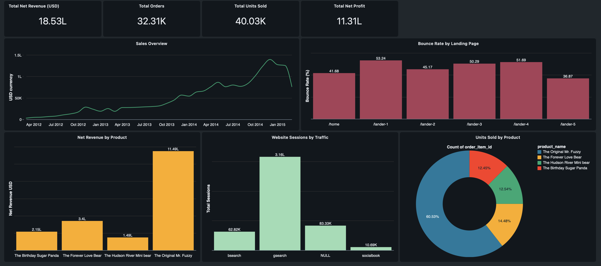

# E-Commerce-Lakehouse-Analytics-Pipeline
## Dataset

This project uses the Maven Analytics Toy Store E-Commerce dataset, which contains website sessions, pageviews, orders, order items, products, and refund data.

Dataset source: [Link](https://mavenanalytics.io/data-playground/toy-store-e-commerce-database)

The raw dataset is not included in this repository. Download the files from the link above and upload them to a Databricks Unity Catalog Volume before running the notebooks.

## Analytics Dashboard

An interactive Databricks AI/BI dashboard was created using the Gold-layer tables to monitor revenue, orders, units sold, profit, product performance, traffic channels and landing-page bounce rates.

